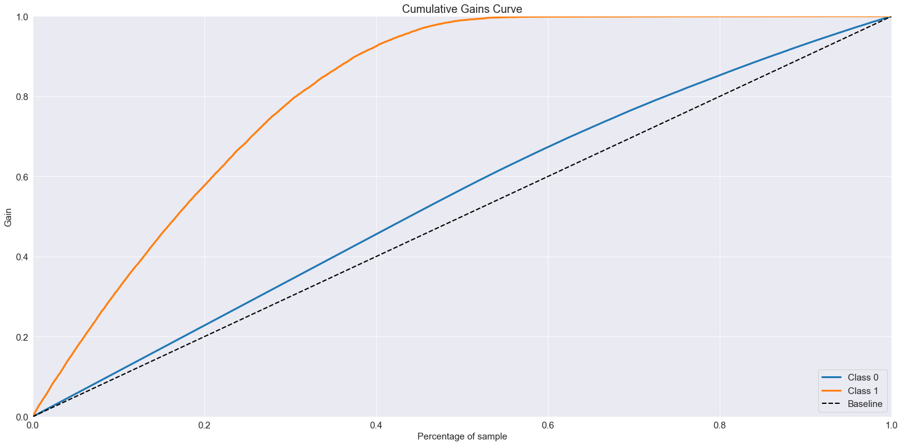
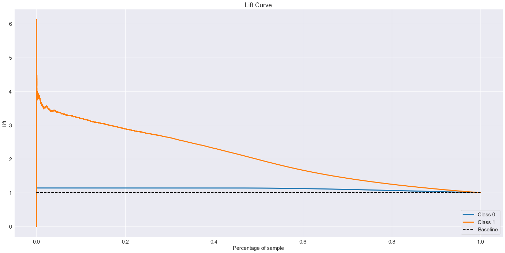
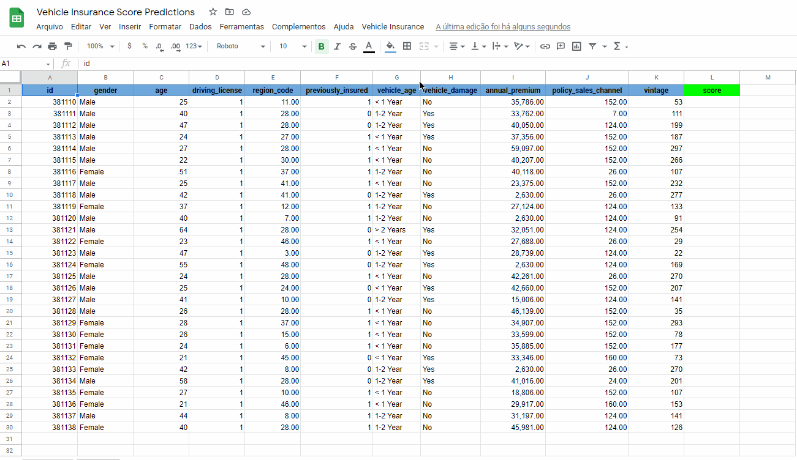

# Insurance Cross-Sell Propensity Score

## 1. Introduction

Insurance All is a mainly health insurance company and the product team is studying the viability of offering to customers a new product: A Vehicle Insurance. For this, they proposed a research with some of their customers asking about the interest on the new proposed product and also to collect some features. The resulted database presents the following columns:

* id: ID of the customer;
* Gender: Gender of the customer;
* Age: Age  of the customer;
* Driving License: Whether the customer have a Driving License;
* Region Code: Region Code of the location of the customer;
* Previously Insured: Whether the customer had their Vehicle insured before;
* Vehicle Damage: Whether the customer had their Vehicle damage before;
* Annual Premium: The annual paid value of the customer;
* Policy Sales Channel: Code of channel used to contact customer;
* Vintage: Number of days the customer is insured by the company;
* Response: Whether the customer is interested on the new Vehicle Insured product.

Now, the product team separated a database of 127.000 new customers to be targeted by the sales of the Vehicle Insurance product. However, the Sales Team only have the capacity to make 20.000 calls. 

## 2. Proposed Solution

To solve this problem, a Data Science Solution is proposed consisting of a Machine Learning model capable of predicting the customers interest on the new product based on their characteristics collected on the research. The results from the model are presented as a Probability Score of Interest, in a way that the Sales Team can focus on the high-scored customers first to make the most of the available calls. 

## 3. Insights Obtained

During the development of the solution, some interesting insights were obtained:

* Most of the interested customers have their vehicles aged between 1 and 2 years;
* Interest in the Vehicle Insurance offer vary according to Region;
* Interest and occurences of Vehicle Damage in the past seems to not be correlated.

## 4. Machine Learning Model 

After a couple of tests, a XGBoost Model is selected to be the main core of the solution proposed, based on it's better results, which are demonstrated below on the Validation data by two plots: 

* Cumulative Gain Curve, which demonstrate the percentage of Interested Customers reached by the percentage of the ordered list used. The results are compared to a Baseline Random Selection Model.

* Lift Curve, which similarly to the Cumulative Gain Curve, shows the reached interested customers by the percentage of the list used, but presented as a Ratio of these values. So, if the use of 40% of the list can reach 80% of the interested customers, a Lift Score of 2 is associated. Again, the results are compared to a Random Baseline Model.

## 5. Model Deployment

To make the model and it's results acessible to the Sales Team, an API was developed and deployed to Heroku, which is then acessed by a spreadsheet on Google Sheets, where a customer can be inserted and their Score prediction generated by a press of a button.

## 6. Conclusions

Despite presenting some problems when evaluated throught some more technical metrics, as can be seen in more details on the notebook, the resulted model in terms of the business problem, presented good results, making it a excelent tool to be used by the Sales Team to increase the probability of sucess in the sales of the new product, reaching more clients with the restricted amount of resources.

## 7. Next Steps

Despite the good results, this work still have some space for improvements. Below, some point are listed for future reworks of this project:

* Use Different Learn-to-Rank Methodologies;
* Try more Models;
* Try different Hyperparameter Tuning Techniques;
* Apply Balancing Data Techniques.

---

## References

The data used used on this project was obtained on Kaggle [here](https://www.kaggle.com/anmolkumar/health-insurance-cross-sell-prediction).